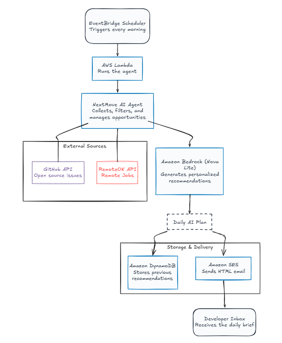
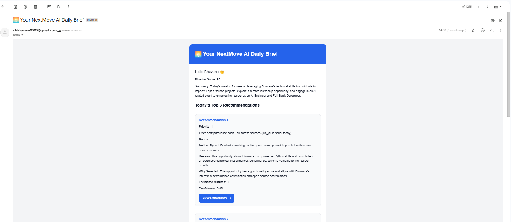
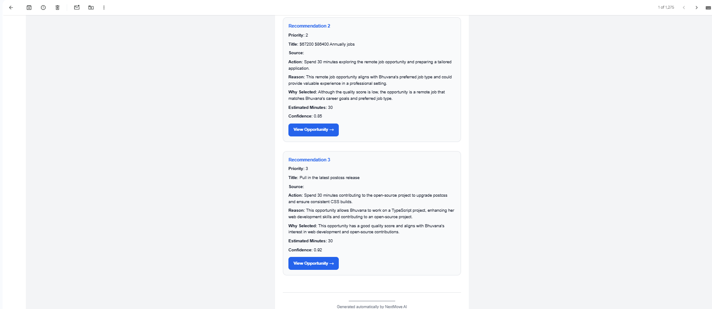
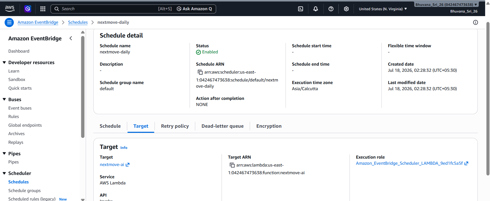
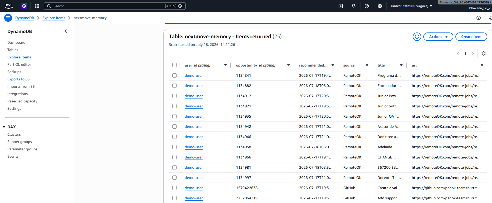
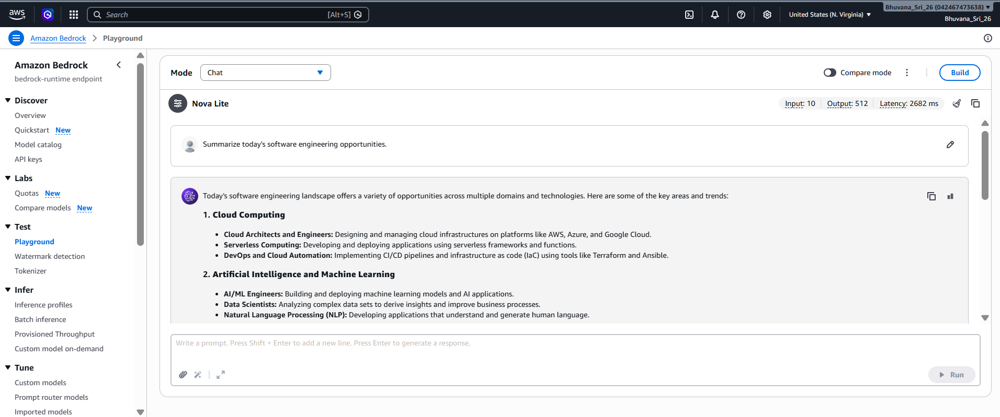
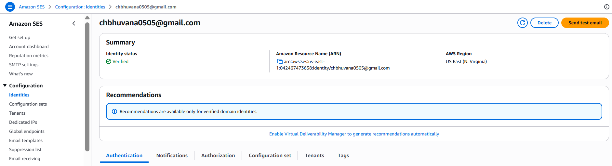

# 🚀 NextMove AI

> An autonomous AI career intelligence agent that discovers high value career opportunities, generates personalized daily action plans using Amazon Bedrock, remembers previous recommendations with DynamoDB, and automatically emails users every day.

Built for the **AWS Weekend Agent Challenge**.

---

## ✨ Overview

Searching multiple websites every day for jobs and open source opportunities is repetitive and time consuming.

**NextMove AI** automates this workflow by collecting opportunities from multiple sources, reasoning over them using Amazon Bedrock, remembering previously recommended opportunities, and delivering a personalized daily brief via email.

Once deployed, the agent runs completely on its own without requiring any manual interaction.

---

## 🌟 Features

- 🤖 Autonomous AI agent powered by Amazon Bedrock (Nova Lite)
- 💼 Collects remote software jobs from RemoteOK
- 🌍 Finds beginner friendly GitHub open source issues
- 🧠 Uses AI reasoning to rank and personalize opportunities
- 🗂 Stores recommendation history in Amazon DynamoDB
- 🚫 Prevents duplicate recommendations
- 📧 Sends beautifully formatted HTML emails using Amazon SES
- ⏰ Runs automatically every day using Amazon EventBridge Scheduler
- ☁️ Deployed on AWS Lambda

---

# 🏗 Architecture



---

## ⚙️ How It Works

1. Amazon EventBridge Scheduler triggers the agent every morning.
2. AWS Lambda executes the Career Agent.
3. GitHub and RemoteOK providers fetch fresh opportunities.
4. Duplicate and previously recommended opportunities are filtered.
5. Amazon Bedrock (Nova Lite) analyzes every opportunity.
6. A personalized daily action plan is generated.
7. Recommendation history is stored in Amazon DynamoDB.
8. Amazon SES sends a personalized HTML email to the user.

---

# 📸 Screenshots

## Daily AI Email




---

## AWS Lambda Deployment


---

## EventBridge Scheduler



---

## Amazon DynamoDB Memory



---

## Amazon Bedrock (Nova Lite)



---

## Amazon SES



---


---

# ☁️ AWS Services Used

| AWS Service | Purpose |
|-------------|---------|
| Amazon Bedrock | AI reasoning and recommendation generation |
| AWS Lambda | Executes the autonomous agent |
| Amazon EventBridge Scheduler | Automatically triggers the agent every day |
| Amazon DynamoDB | Stores recommendation history and prevents duplicates |
| Amazon SES | Sends personalized HTML email reports |

---

# 📂 Project Structure

```
nextmove-ai/
│
├── agent/
├── aws/
├── models/
├── providers/
├── services/
├── screenshots/
│
├── app.py
├── lambda_function.py
├── config.py
├── profile.json
├── requirements.txt
├── README.md
└── .gitignore
```

---

# 🧠 AI Workflow

```
EventBridge Scheduler
        │
        ▼
AWS Lambda
        │
        ▼
NextMove AI Agent
        │
GitHub API + RemoteOK API
        │
        ▼
Amazon Bedrock
        │
Personalized Daily Plan
        │
 ┌──────────────┴──────────────┐
 ▼                             ▼
DynamoDB                  Amazon SES
(Store Memory)          (Send Email)
        │
        ▼
Developer Inbox
```

---

# 🚀 Running Locally

Clone the repository:

```bash
git clone https://github.com/Bhuvana2605/nextmove-ai.git

cd nextmove-ai
```

Install dependencies:

```bash
pip install -r requirements.txt
```

Configure environment variables:

```env
GITHUB_TOKEN=your_github_token

SENDER_EMAIL=your_verified_email

RECIPIENT_EMAIL=your_verified_email
```

Run the application:

```bash
python app.py
```

---

# 🛠 Challenges Faced

During development, several practical challenges were encountered:

- GitHub API rate limiting
- Preventing AI hallucinations in generated recommendations
- Filtering duplicate opportunities
- Deploying a local Python application to AWS Lambda
- Persisting recommendation history with DynamoDB
- Configuring Amazon SES sandbox for email delivery
- Scheduling fully autonomous execution using EventBridge Scheduler

---

# 🔮 Future Improvements

- LinkedIn Jobs integration
- Greenhouse Jobs integration
- Devpost and hackathon opportunities
- AI event discovery
- Slack and Discord notifications
- Multi user support
- Web dashboard for recommendation history
- User authentication

---

# 👩‍💻 Author

**Bhuvana**

Built for the **AWS Weekend Agent Challenge** using Amazon Bedrock, AWS Lambda, Amazon EventBridge Scheduler, Amazon DynamoDB, and Amazon SES.
