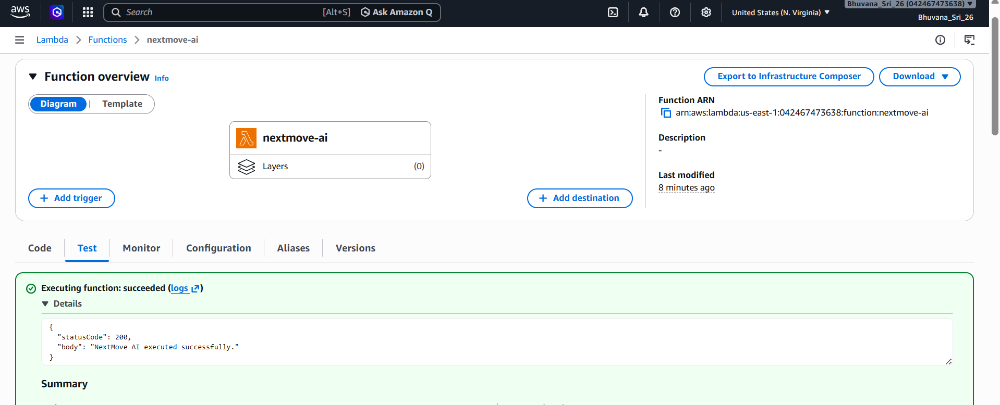

# 🚀 NextMove AI

An autonomous AI career intelligence agent that discovers high-value career opportunities, reasons over them using Amazon Bedrock, remembers previous recommendations with DynamoDB, and automatically emails a personalized daily action plan.

Built for the AWS Weekend Agent Challenge.

---

# ✨ Features

- 🤖 Autonomous AI agent powered by Amazon Bedrock (Nova Lite)
- 💼 Collects remote jobs from RemoteOK
- 🌟 Finds beginner-friendly GitHub open source issues
- 🧠 Uses AI reasoning to create a personalized daily action plan
- 🗂 Remembers previous recommendations using Amazon DynamoDB
- 📧 Sends a beautiful HTML email using Amazon SES
- ⏰ Runs automatically every day using EventBridge Scheduler
- ☁️ Hosted on AWS Lambda

---

# 🏗 Architecture

```
                EventBridge Scheduler
                         │
                         ▼
                  AWS Lambda
                         │
                         ▼
                  CareerAgent
                         │
          ┌──────────────┴──────────────┐
          ▼                             ▼
     GitHub API                    RemoteOK API
          │                             │
          └──────────────┬──────────────┘
                         ▼
                 Amazon Bedrock
                  (Nova Lite)
                         │
                  Daily AI Plan
                         │
          ┌──────────────┴──────────────┐
          ▼                             ▼
      DynamoDB                    Amazon SES
          │                             │
          └──────────────┬──────────────┘
                         ▼
                    Developer Inbox
```

---

# 🛠 AWS Services Used

| Service | Purpose |
|----------|---------|
| Amazon Bedrock | AI reasoning using Nova Lite |
| AWS Lambda | Executes the autonomous agent |
| Amazon EventBridge Scheduler | Triggers the agent every day |
| Amazon DynamoDB | Stores recommendation history |
| Amazon SES | Sends personalized HTML emails |

---

# 🧠 How It Works

1. EventBridge triggers Lambda every morning.
2. Lambda starts NextMove AI.
3. GitHub and RemoteOK are queried.
4. Duplicate opportunities are removed.
5. DynamoDB filters already recommended opportunities.
6. Amazon Bedrock analyzes all remaining opportunities.
7. A personalized action plan is generated.
8. Recommendations are stored in DynamoDB.
9. A beautiful HTML email is sent using Amazon SES.

---

# 📂 Project Structure

```
nextmove-ai/

agent/
aws/
models/
providers/
services/

app.py
config.py
lambda_function.py
profile.json
requirements.txt
```

---

## Screenshots

### Daily Email


### Lambda



### EventBridge Scheduler


# 🚀 Running Locally

```bash
pip install -r requirements.txt

python app.py
```

---

# 🔐 Environment Variables

```
GITHUB_TOKEN=

SENDER_EMAIL=

RECIPIENT_EMAIL=
```

---

# 🚧 Challenges Faced

- GitHub API rate limiting
- Preventing Bedrock from hallucinating opportunities
- Deploying a local project to AWS Lambda
- Managing persistent memory with DynamoDB
- Configuring Amazon SES sandbox
- Scheduling autonomous execution with EventBridge

---

# 💡 Future Improvements

- LinkedIn Jobs integration
- Greenhouse Jobs integration
- AI learning event provider
- Slack and Discord notifications
- User dashboard
- Multi-user support

---

# 👩‍💻 Author

**Bhuvana**

Built during the AWS Weekend Agent Challenge.
